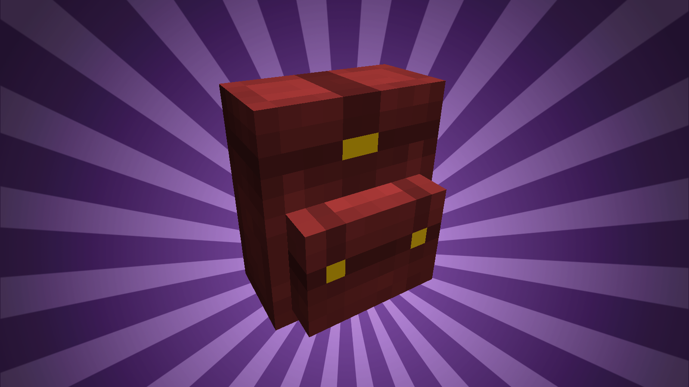
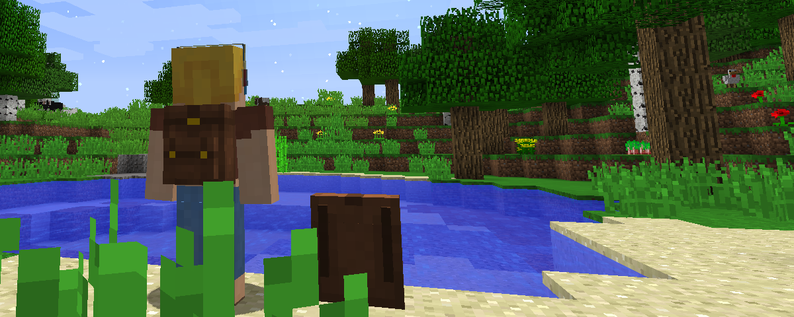
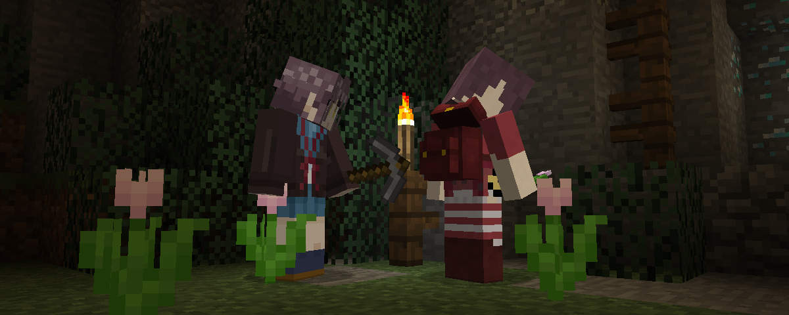
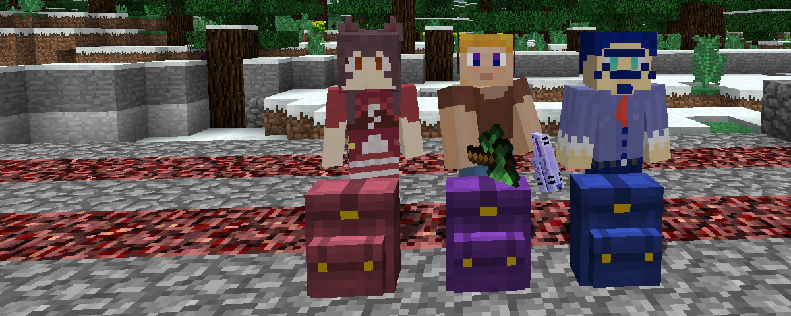

# Wearable Backpacks

.. is a Minecraft mod which adds **backpacks**. But wait! It's not like anything you've
seen before. **Wearable Backpacks** continues the legacy of [BetterStorage][BS]'s
backpacks, and brings with it a beautifully designed and balanced alternative backpack
option unlike any other!

*"Backpacks are love. Backpacks are life."* -asiekierka
*"copy-who?"* -MindlessPuppetz

## What's so great?

- **There can be only one!**
  Other mods allow you to carry multiple backpacks in your inventory. **WBs** doesn't.
  This design, as well as the resulting implementation has been carried over from its
  predecessor. But what the mod is lacking in convenience, it's trying to make up in
  charm and configurability.

  

- **Armor up, or storage up?**
  With the default settings, backpacks will function as armor, taking up the chest armor
  equipment slot, protecting from as well as taking damage just like leather armor. This
  way, you have to *choose* between more protection or more storage. This can be turned
  off though, in case you don't like it.

- **Play with friends, share backpacks!**
  Having a backpack on your back looks cool and all, but if only you could do something
  with that beauty. Well, lucky you! Other players (hopefully, without ill intentions)
  can open your backpack and borrow a pick and some torches on a mining trip. This of
  course only works as long as your back is facing towards them.

  

- **Dying is [FUN][FUN]!**
  Sick of losing all your valuables when you make a small little misstep into the nearest
  pool of lava? Don't worry, the items inside your backpack will be... mostly safe. While
  the backpack itself is not immune to explosions or being broken by other players, after
  death it will gently place itself down near your point of failure, ready to be
  retrieved.

- **Dyeing is fun~!**
  Backpacks can be colored using Minecraft's *fantastic* dyeing system. Unlike some silly
  mods that only allow the 16 base colors, with our pretties you can mix and match your
  dyes to customize them in any way you like!

  

- **Configuration Nation**
  Not sure if **WBs** will fit your play style? Don't worry! This mod is meant to be
  incredibly configurable with its [easy-to-use ingame config menu][CONF]. This allows
  backpacks to be balanced, regardless of whether they're used in a personal hand-picked
  pack, a huge kitchen sink modpack or a deadly hardcore-massacre-of-doom experience with
  sprinkles on top.

## Usage

Think of **Wearable Backpacks** backpacks as portable, wearable chests. After you've
crafted one, simply place it on the ground and fill it with whatever you'd like to take
with you. Next, **sneak** and **break** the backpack to **equip** it. You'll notice that
equipping is faster than breaking.

Now that the backpack is where it belongs (your back), you can **unequip** it again by
**sneaking** and **right-clicking** the ground with an **empty hand** (specifically, the
top of a solid block).

By turning on a config option, it's also possible to open the backpack using a keybind,
which you can find in the controls menu (default: `B`).

### Crafting Recipe

- 7x Leather
- 1x Gold Ingot
- 1x Wool

### Additional Features

- As already mentioned above, this mod has many, easy to use configuration options.
  Simply click **Mods** in the main menu or **Mod Options** ingame, search for
  "Wearable Backpacks" and click the **Config** button.
- When backpacks are equipped as armor, they may also be enchanted just like armor.
  (This feature is missing from 1.10 due to missing enchantment hooks in Forge.)
- Some mobs may rarely spawn with backpacks equipped, containing random loot.

## Download

Available right here through [GitHub Releases][DL] or on [CurseForge][CF].
All profits gained through Curse's reward system go directly to [Child's Play][CPC] charity.

## License & Permissions

**Wearable Backpacks** is licensed under the [MIT license](LICENSE), though feel free to
consider it **public domain**. This applies to both the source code and releases, so you
are free to redistribute, include in modpacks, modify, fork, release your own versions
of this mod as much as you'd like.

If you contribute to this repository, do keep in mind that your contributions will be
treated the same.

## For Modpack / Map Creators

- Custom backpack size can be set using NBT tag `backpack:{size:[x,y]}`.
- Custom armor value can be set using NBT tag `backpack:{armor:x}`.
- Default backpack loot table `wearablebackpacks:backpack/default` can be overridden.
- Backpack spawn settings can be modified: Edit chance, loot table and color.
- Custom entities can be [configured to spawn with backpacks](https://twitter.com/koppeh/status/932956969425653761)!

## Credits

**Authors:** [copygirl](https://github.com/copygirl),
             [asiekierka](https://github.com/asiekierka)

**Contributors:**
- [ChloeDawn](https://github.com/ChloeDawn)
  ([#33](https://github.com/copygirl/WearableBackpacks/pull/33),
   [#50](https://github.com/copygirl/WearableBackpacks/pull/50) and more)
- [IwoPlaza](https://github.com/iwoplaza)
  ([#82](https://github.com/copygirl/WearableBackpacks/pull/82))
- [ichttt](https://github.com/ichttt)
  ([#119](https://github.com/copygirl/WearableBackpacks/pull/119))

### Localization

In the order of their [pull requests][PR] being submitted, here are the lovely people who
provided their translation superpowers to make **WBs** available in other languages:

- **German** (de_DE): [Vexatos](https://github.com/Vexatos)
- **Chinese** (zh_CN): [3TUSK](https://github.com/3TUSK)
- **Dutch** (nl_NL): [TDarkShadow](https://github.com/TDarkShadow)
- **Russian** (ru_RU): [kirill3345](https://github.com/kirill3345),
                       [dangranos](https://github.com/dangranos),
                       [raspopov](https://github.com/raspopov)
- **Korean** (ko_KR): [tinywolf3](https://github.com/tinywolf3)
- **Portuguese** (pt_BR): [wenlfs](https://github.com/wenlfs),
                          [eduardogomesv](https://github.com/eduardogomesv),
                          [DaDodger](https://github.com/DaDodger)
- **Spanish** (es_MX): [Dorzar](https://github.com/Dorzar)
- **Italian** (it_IT): [Insane-96](https://github.com/Insane-96)
- **Danish** (da_DK): [Zerotiger](https://github.com/Zerotiger)
- **Slovenian** (sl_SI): [SFort](https://github.com/SFort)
- **Slovak** (sk_SK): [rufo123](https://github.com/rufo123)

### Special thanks to ...

- **asiekierka** for being an amazing friend in general, letting me use [Charset][CS]
  as a reference and updating the mod to 1.11, so he's getting a co-author mention. ❤
- The **Penguins' Retreat** server for encouraging me to rework / finish this mod.

## Contact

Feature requests and bug reports belong on the [issue tracker][IT]. For general
inqueries, discussions and praise, you can contact **copygirl** directly at
[Twitter (@koppeh)][TWIT] or via [email][MAIL], but you're also very welcome to join our
little community's IRC channel (#obsidian on Esper.net) and [Discord guild][DISC].

*In the event that this mod becomes self-aware, we are not responsible for any damage it causes.*

[IT]: https://github.com/copygirl/WearableBackpacks/issues?q=is%3Aissue
[PR]: https://github.com/copygirl/WearableBackpacks/pulls?q=is%3Apr
[DL]: https://github.com/copygirl/WearableBackpacks/releases
[CF]: https://minecraft.curseforge.com/projects/wearable-backpacks

[CONF]: https://twitter.com/koppeh/status/832019096803885057

[BS]: https://github.com/copygirl/BetterStorage
[CS]: http://charset.asie.pl/

[TWIT]: https://twitter.com/koppeh
[MAIL]: mailto:copygirl@mcft.net
[DISC]: https://discord.gg/0bNJM8qj0Jiv6BlK

[CPC]: http://childsplaycharity.org/
[FUN]: http://dwarffortresswiki.org/index.php/DF2014:Fun
